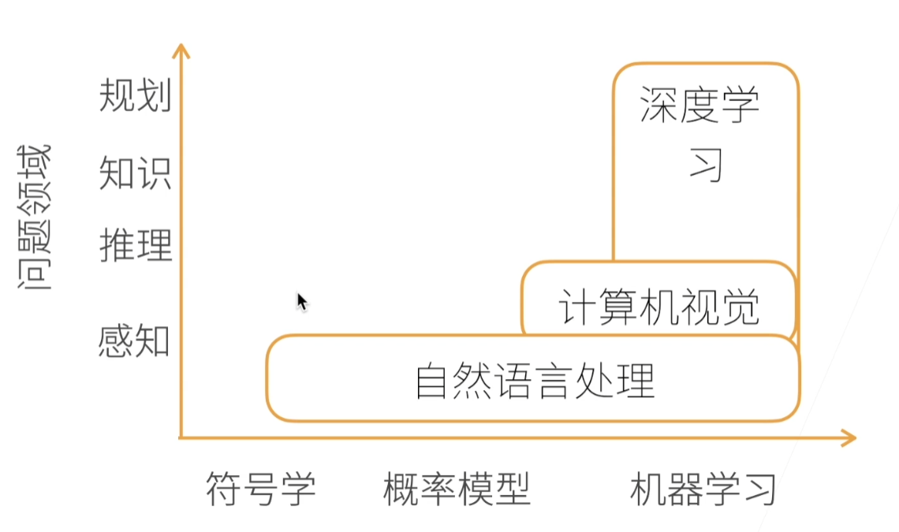

# 0 课程安排 03.20

## 0.1 目标

### 0.1.1 深度学习经典和最新模型

- LeNet
- ResNet
- LSTM
- BERT

### 0.1.2 机器学习基础

- 损失函数
- 目标函数
- 过拟合
- 优化

### 0.1.3 实践

- 使用Pytorch实现
- 使用真实数据体验算法效果

## 0.2 内容

- 深度学习基础 —— 线性神经网络，多层感知机
- 卷积神经网络—— LeNet,AlexNet,VGG,Inception,ResNet
- 循环神经网络 —— RNN,GRU,LSTM,seq2seq
- 注意力机制 —— Attention,Transformer
- 优化算法 —— SGD,Momentum,Adam
- 高性能计算 —— 并行，多GPU，分布式
- 计算机视觉 —— 目标检测，语义分割
- 自然语言处理 —— 词嵌入，BERT

### 0.2.1链接

- 课程主页 <https://courses.d2l.ai/zh-v2>
- 教材 <https://zh-v2.d2l.ai>
- 课程论坛讨论 <https://discuss.d2l.ai/c/16>
- Pytorch论坛 <https://discuss.pytorch.org>

## 0.3 深度学习介绍

### 0.3.1 AI地图



---

### 0.3.2 应用

- 图片分类 <http://www.image-net.org> 深度学习已经做的很好
- 物体检测和分割
- 样式迁移 内容图片和样式图片合成 比如照片和油画合成
- 人脸合成
- 文字生成图片
- 文字生成 gpt3模型 &生成sql
- 无人驾驶

---

### 0.3.3 案例研究  广告点击

1. 触发
2. 点击率预估
3. 排序 （点击率x竞价）

#### 0.3.3.1 预测

1. 特征提取（广告主，产品描述，产品图片）
2. 放进模型
3. 点击率预测

#### 0.3.3.2 训练

1. 训练数据（过去广告展现和用户点击）
2. 特征和用户点击
3. 训练出模型

## 0.4 安装

- 使用conda 环境

- 安装需要的包

  ` pip install -y jupyter d2l torch torchvision`

- 下载代码并执行(课程中讲的是远程)

### 0.4.1 GitHub上的代码  

<https://github.com/d2l-ai/d2l-zh-pytorch-slides>

### 0.4.2 教材中有colab链接直接运行

## 0.5 数据操作

N维数组是机器学习和神经网络的主要数据结构

例 3-d 

[

[

[1,2,3] [1,2,3] [1,2,3] 

]

[

[1,2,3] [1,2,3] [1,2,3]

]

]

### 0.5.1 创建数组

- 形状
- 每个元素的数据类型 （例如浮点）
- 每个元素的值

### 0.5.2 访问元素（左闭右开）

- 一个元素 [1,2] 第一行第二个 下标从零开始
- 一行 [1,:] 第一行
- 一列 [:,1] 第一列
- 子区域 [1:3,1:]  一到三行前，一到最后一列
- 子区域 [::3,::2]  每三行，每两列取数

### 0.5.3数据操作

1. ` import torch` 

   *ctrl+enter = run*

2. 张量表示一个数值组成的数组

   ```python
    x = torch.arange(12)   //生成向量
    x  //output
   ```

3. 通过张量的shape属性来访问张量的形状和张量中元素的总数

   ```python
   x.shape
   x.numel()
   ```

4. reshape 改变一个张量的形状而不改变元素数量和元素值

   ```python
   X = x.reshape(3,4)
   X
   ```

5. 给对应形状的元素赋值为全0、全1、其他常量

   ```python
   torch.zeros((2,3,4))
   torch.ones((2,3,4))
   ```

6. 通过提供包含数值的python列表来为所需张量中的每个元素赋予确定值

   ` torch.tensor([[2,1,4,3],[2,1,4,3]])`

7. 标准算术运算符，按元素进行 + - * / **          *注意浮点等数据类型*

8. 把多个张量合并

   ` torch.cat((X,Y),dim=0)` 把两个张量合并

   dim 0 1 2 3 ... 对应  x y z ... 

   0是行 1 是列 2是3维的z

9. 通过逻辑运算符构建二元张量  ` X==Y`

10. 对张量中的所有元素求和产生一个只有一个元素的张量

    `X.sum()`

11. 广播机制，形状不同，维度相同 

    两个向量相加时可能出现矩阵

12. 通过指定索引将元素写入矩阵

    为多个元素赋值相同的值，索引所有元素

    ```python
    X[-1] //选择最后一个元素
    X[1:3] //选择第二个和第三个元素
    X[1,2]=9 //选择第1行第2列赋值
    X[0:2,:]=12 //选择0行和一行的所有列
    X
    ```

13. 运行一些操作可能会导致为新结果分配内存

    ```python
    before = id(Y)
    Y = Y + X
    id(Y) == before //id是Y的指针，Y进行运算后，指针改变
    
    //原地操作
    Z = torch.zeros_like(Y)  //形状维数相同
    print('id(Z):',id(Z))
    Z[:] = X + Y
    print('id(Z):',id(Z)
    ```

    如果后续计算中没有重复使用X，可以使用X[:] = X+Y或者X+=Y 来减少操作的内存开销

14. torch的tensor转换为NumPy张量

    ```python
    A = X.numpy()
    B = torch.tensor(A)
    type(A),type(B)
    
    //out (numpy.ndarray,torch.Tensor)
    ```

15. 将大小为1的张量转换为Python标量

    ```python
    a = torch.tensor([3.5])
    a,a.item(),float(a),int(a)
    ```

### 0.5.4 数据预处理

- 创建一个人工数据集存储在csv

- 从创建的csv文件中加载原始数据集 用pandas

  print 或者不print（html格式）

- 处理缺失的数据，插值和删除为典型方法

- iloc[:,0:2] 索引位置 

- fillna(inputs.mean()) 填成均值

- get_dummies(inputs,dummy_na=True) 分类 0 或 1


