# 1 线性代数 3.21

## 1.1 标量

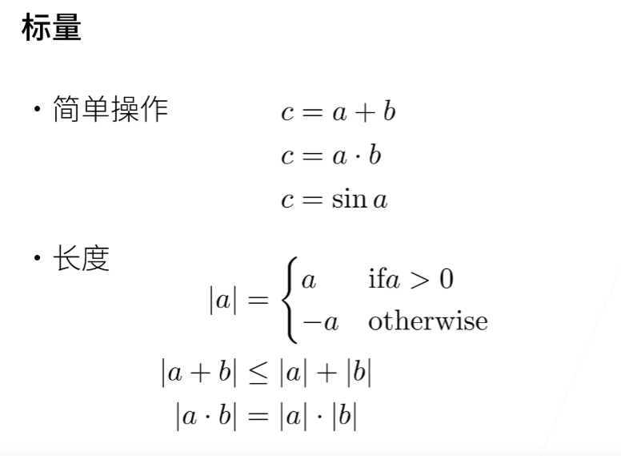

## 1.2 向量

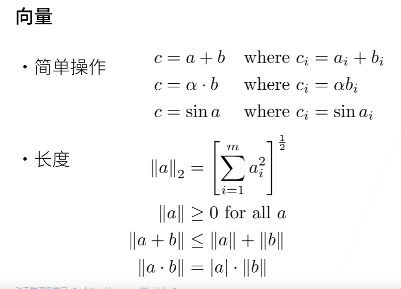

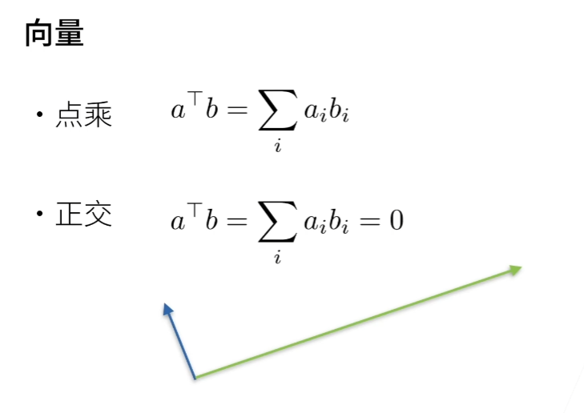

## 1.3 矩阵

- 相加 和单向量相乘 转成三角函数
- 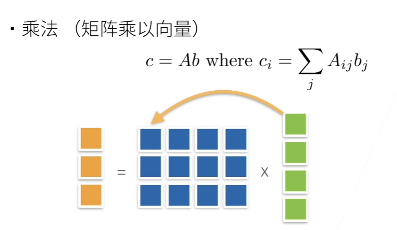

第一矩阵的行x第二矩阵的列 相加 为每一个元素

- 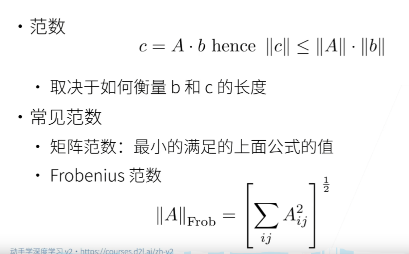

- 对称 反对称 正定
- 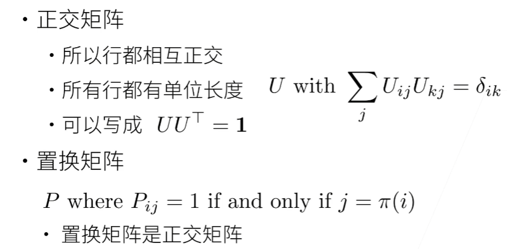

- 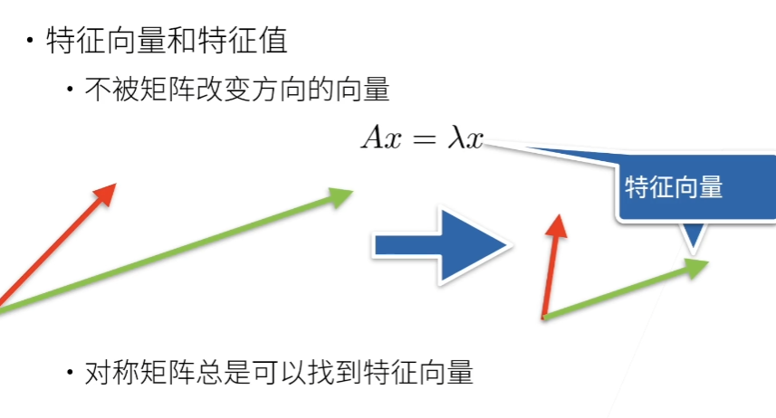

## 1.4 线性代数实现

### 1.4.1 标量

```python
import torch

x=torch.tensor([3.0])
y=torch.tensor([2.0])
x+y,x*y,x/y,x**y
```

### 1.4.2 向量 标量组成的列表

```python
x=torch.arrange(4) //生成张量
x[3] //通过索引访问元素
len(x) //张量的长度
x.shape //张量的形状
```

### 1.4.3 矩阵

```python
A = torch.arange(20).reshape(5,4)
A //生成一个20个元素的列表变成五行四列的矩阵
A.T //矩阵的转置
A == A.T //对称矩阵
A = torch.arange(20，dtype=torch.float32).reshape(5,4)
B=A.clone() //A的一个副本分配给B
A*B //两个矩阵的乘法
x.sum() //所有元素的和
A.sum(axis=0.keepdims=True)//根据维度求和并且不想丢掉维度，想用广播机制时
A.mean() //求平均值
A.average //求平均值
a.numel() //元素个数
A.cumsum(axis=0) //某个轴计算A元素的累积总和
torch.dot(x,y) //点积
torch.mv(A,x) //矩阵乘向量
torch.mm(A,B) //两个矩阵相乘
torch.norm(u) //L2范数 F范数
torch.abs(u).sum() //L1范数 常用

shape[2,5,4]
A.sum(axis=0) shape[5,4]
A.sum(axis=1,keepdim=True) 
shape[2,1,4]求和
A.sum(axis=[1,2],keepdim=True) 
shape[2,1,1]求和
```

## 1.5矩阵计算

### 1.5.1导数

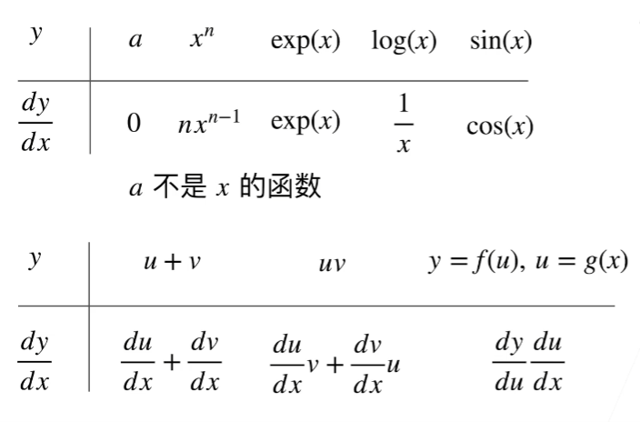

### 1.5.2 偏导

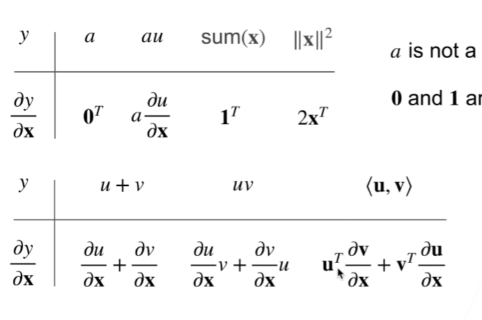

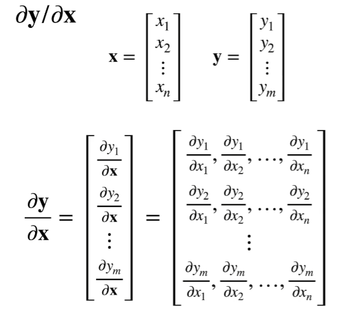

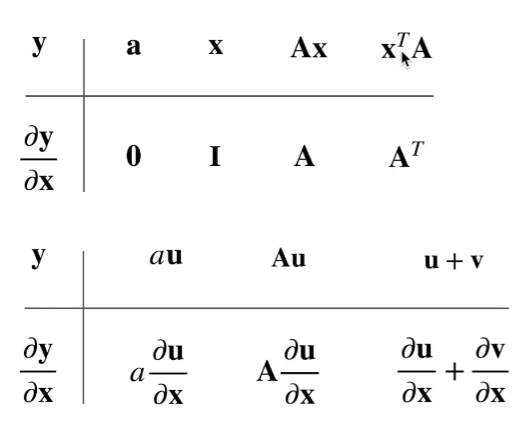

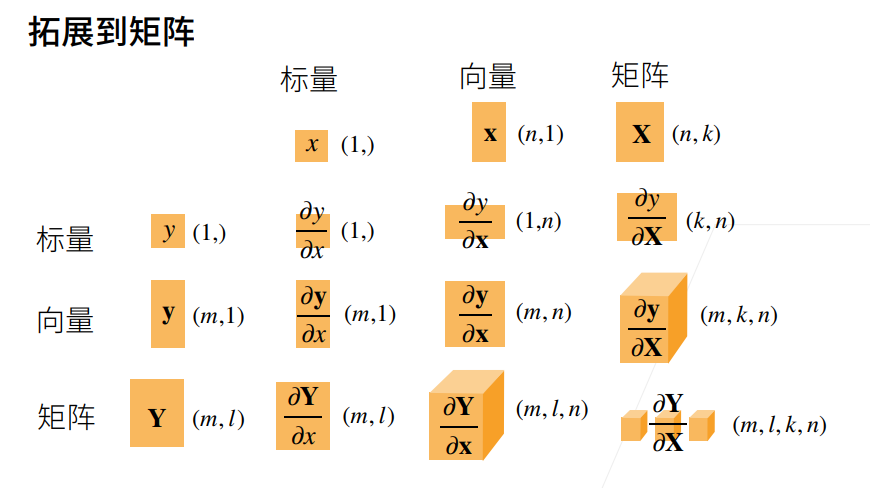

## 1.6 自动求导

### 1.6.1 向量链式法则

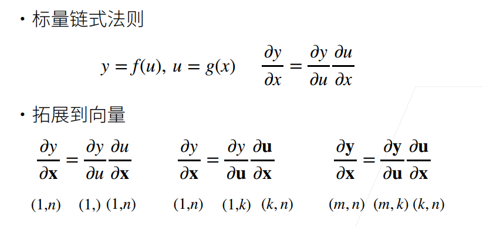

### 1.6.2 自动求导

- 自动求导计算一个函数在指定值的导数
- 将代码分解成操作子
- 将计算表示成一个无环图
- 显式构造 Tensorflow/Theano/MXNet
- 隐式构造 PyTorch/MXNet
- 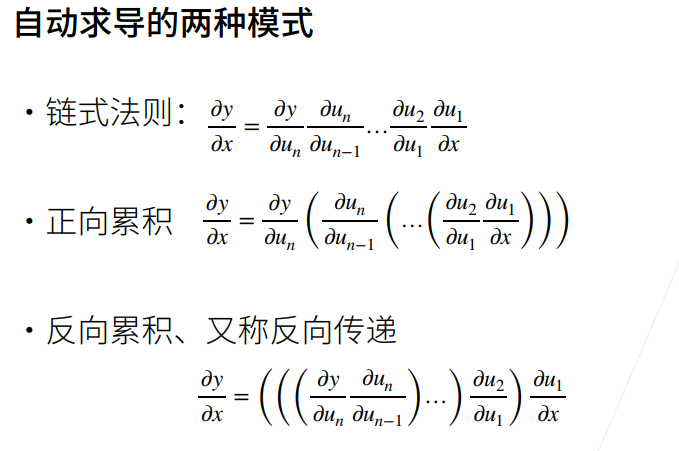

### 1.6.3 反向累积

- 构造计算图
- 前向：执行图，存储中间结果
- 反向：从相反方向执行图 去除不需要的枝
- 计算复杂度 O(n)
- 内存复杂度 O(n)

### 1.6.4 正向累积

- 计算复杂度 O(n)
- 内存复杂度 O(1)


