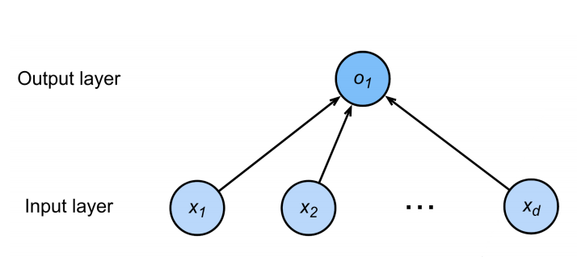
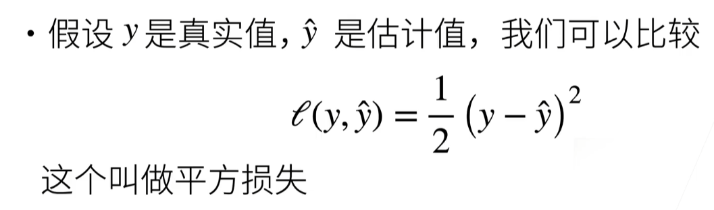
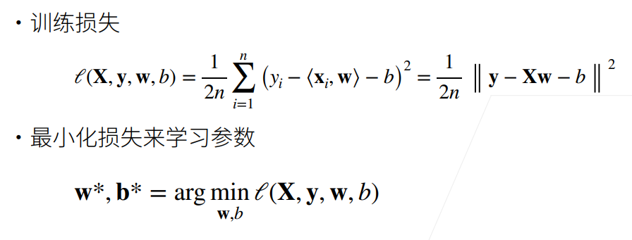
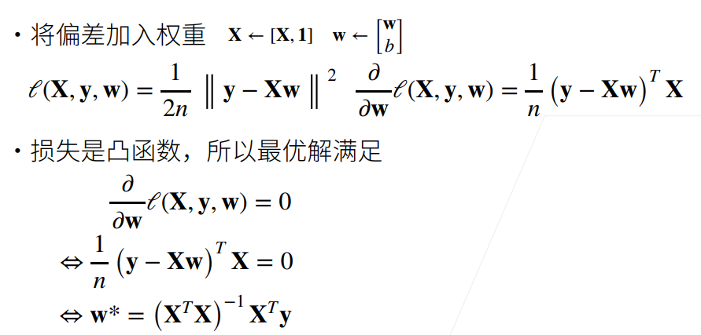

#                                                                                                                                                     2 线性回归 3.27

## 2.1 线性模型

### 2.1.1 定义模型

- 给定n维输入 x = $[x_1,x_2,...,x_n]^T$

- 线性模型有一个n维权重和一个标量偏差 

  w = $[w_1,w_2,...,w_n]^T$,b

- 输出是输入的加权和

  y=$w_1$$x_1$+$w_2$$x_2$+...+$w_n$$x_n$+b

  向量版本：y=<w,x>+b

- 线性模型可以看作是单层神经网络

- 神经网络源于神经科学

### 2.1.2 衡量预估价值

- 比较真实值和预估值

### 2.1.3 训练数据

- 收集一些数据点来决定参数值（权重和偏差）

- 被称为训练数据，越多越好

- 假设我们有n个样本，记

  x = $[x_1,x_2,...,x_n]^T$  y = $[y_1,y_2,...,y_n]^T$

### 2.1.4 参数学习

### 2.1.5 显示解

唯一一个有最优解的模型

### 2.1.6 总结

- 线性回归是对n维输入的加权，外加偏差
- 使用平方损失来衡量预测值和真实值的差异
- 线性回归有显示解
- 线性回归可以看作是单层神经网络

## 2.2 基础优化方法

### 2.2.1 梯度下降

- 挑选一个初始值$w_0$

- 重复迭代参数t=1,2,3

  

- 沿梯度方向将增加损失函数值
- 学习率：步长的超参数 不能太小，也不能太大

### 2.2.2 小批量随机梯度下降

- 在整个训练集上算梯度太贵

- 一个深度神经网络模型可能需要数分钟至数小时

- 我们可以随机采样b个样本$i_1$,$i_2$,...,$i_b$来近似损失

  $\frac1b \sum_ {i\epsilon I_b} $ f($x_i$,$y_i$,w)

  b是批量大小，另一个重要的超参数

- 选择批量大小 

  不能太小，每次计算量太小，不适合并行来最大利用计算资源

  不能太大，内存消耗增加，浪费计算，例如所有样本都是相同的

### 2.2.3 总结

- 梯度下降通过不断沿着反梯度方向更新参数求解
- 小批量随机梯度下降是深度学习默认的求解算法
- 两个重要的超参数是批量大小和学习率
