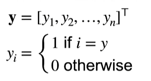
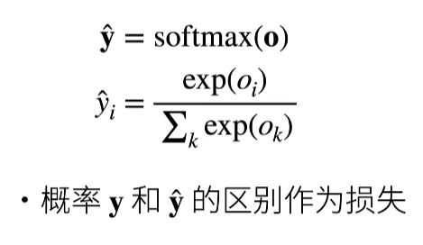
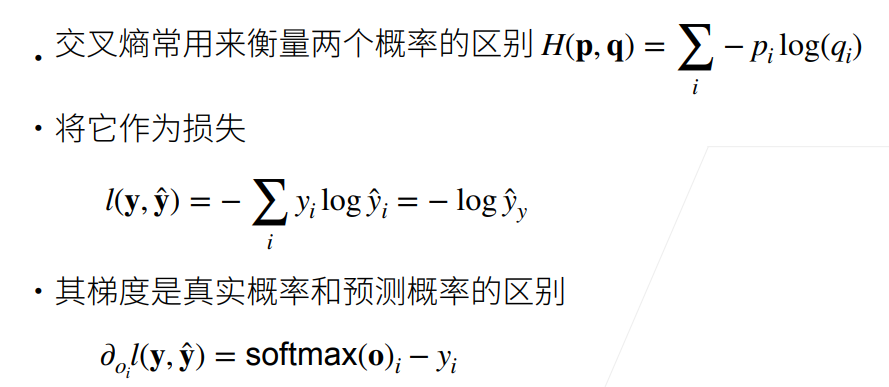
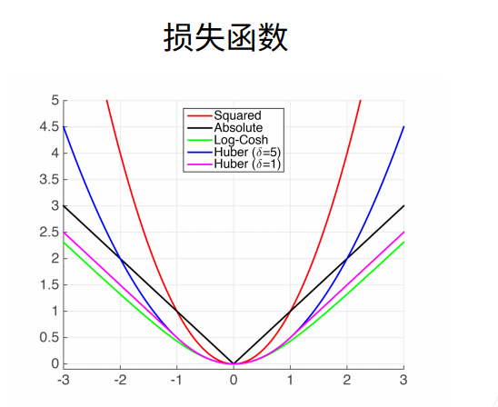
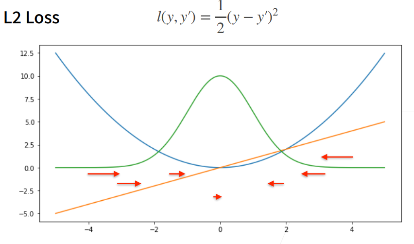
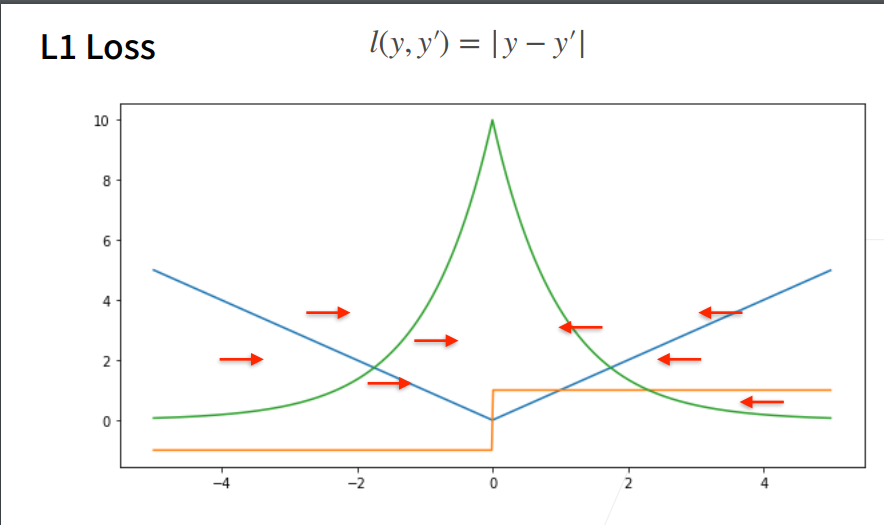
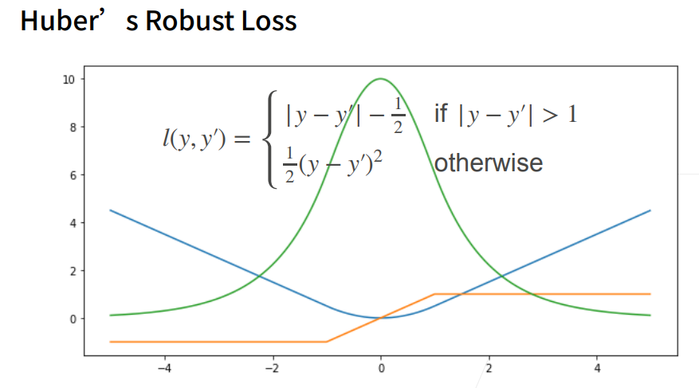

# 3 Softmax回归 3.28

## 3.1 回归与分类

回归是估计一个连续值，分类是预测一个离散类别

回归

- 单连续数值输出
- 自然区间R
- 跟真实值的区别作为损失

分类

- 通常多个输出
- 输出i 是预测为第i类的置信度

### 3.3.1 从回归到多类分类—均方损失

- 对类别进行一位有效编码

  

- 使用均方损失训练

- 最大值为预测 y = argmax$o_i$

### 3.3.2 从回归到多类分类—无校验比例

- 对类别进行一位有效编码

- 最大值为预测 y = argmax$o_i$

- 需要更置信的识别正确类（大余量）

  $o_y-o_i \geq \Delta(y,i) $

### 3.3.3 从回归到多类分类 — 校验比例

- 输出匹配概率（非负，和为1）

### 3.3.4 Softmax和交叉熵损失

### 3.3.5 总结

- Softmax回归是一个多类分类模型
- 使用Softmax操作子得到每个类的预测置信度
- 使用交叉熵来衡量预测和标号的区别

## 3.2 损失函数

### 3.2.1 L2 Loss

### 3.2.2 L1 Loss

### 3.2.3 Huber's Robust Loss

