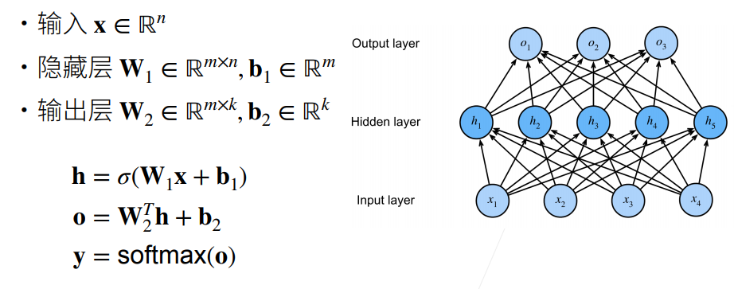

# 4 感知机

最早的人工智能模型

- 给定输入x，权重w，和偏移b，感知机输出

  

- 二分类：-1或1

  线性回归输出的是实数

  Softmax回归输出的是概率

## 4.1 训练感知机

### 4.1.1 算法

initialize w=0 and b=0

repeat 

​	if $y_i[<w,x_i>+b]\leq0$ then

​		$w<- w+y_ix_i$ and $b <- b+y_i$

​	end if

until all classified correctly

等价于使用批量大小为1的梯度下降并使用如下的损失函数

$l(y,x,w)=max(0,-y<w,x>)$

### 4.1.2 收敛定理

- 数据在半径r内

- 余量$\rho$分类两类

  $y(x^Tw+b)\geq\rho$

  对于$||w||^2+b^2\leq1$

- 感知机保证在$\frac {r^2+1} \rho^2$步后收敛

###  4.1.3 XOR问题

感知机不能拟合XOR函数，它只能产生线性分割面

###  4.1.4 总结

- 感知机是一个二分类模型，是最早的AI模型之一
- 它的求解算法等价于使用批量大小为1的梯度下降
- 它不能拟合XOR函数，导致第一次AI寒冬

## 4.2 多层感知机

### 4.2.1 单隐藏层 — 单分类

### 4.2.2 Sigmoid激活函数

### 4.2.3 Tanh激活函数

### 4.2.4 ReLU激活函数

### 4.2.5 多类分类

### 4.2.6 多隐藏层

### 4.2.7 总结

- 多层感知机使用隐藏层和激活函数来得到非线性模型
- 常用激活函数是Sigmoid,Tanh,ReLU
- 使用Softmax来处理多类分类
- 超参数为隐藏层数，和各个隐藏层大小

