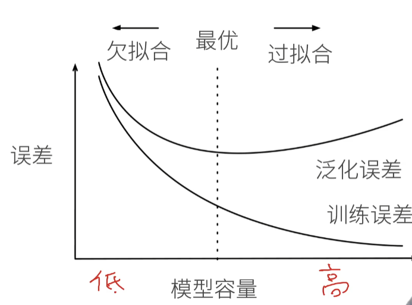

# 5 模型选择

## 5.1 训练误差和泛化误差

- 训练误差：模型在训练数据上的误差
- 泛化误差：模型在新数据上的误差

## 5.2 验证数据集和测试数据集

- 验证数据集：一个用来评估模型好坏的数据集
- 例如：拿出50%的训练数据 （不要跟训练数据混在一起，训练数据和验证数据不能重复！
- 测试数据集：只用一次的数据集
- 例如：未来的考试，我出价的房子的实际成交价，用在Kaggle私有排行榜中的数据集

## 5.3 K-则交叉验证

- 在没有足够多数据时使用（这是常态）
- 算法：
  - 将训练数据分割成K块
  - For i =1,...,K
  - 使用第i块作为验证数据集，其余的作为训练数据集
  - 报告K个验证集误差的平均
  - 常用K=5或10

## 5.4 总结 

- 训练数据集：训练模型参数
- 验证数据集：选择模型超参数
- 非大数据集上通常使用K-则交叉验证

## 5.5 过拟合和欠拟合

| 模型容量/数据 | 简单   | 复杂   |
| ------------- | ------ | ------ |
| 低            | 正常   | 欠拟合 |
| 高            | 过拟合 | 正常   |

### 5.5.1 模型容量

- 拟合各种函数的能力
- 低容量的模型难以拟合训练数据
- 高容量的模型可以记住所有的训练数据

### 5.5.2 模型容量的影响

模型先足够大，控制模型容量，降低泛化误差

### 5.5.3 估计模型容量

- 难以在不同种类算法之间比较
- 例如树模型和神经网络
- 给定一个模型种类，将有两个主要因素
- 参数的个数
- 参数值的选择范围

## 5.6 VC维

- 统计学习理论的一个核心思想
- 对于一个分类模型，VC等于一个最大的数据集的大小，不管如何定标号，都存在一个模型对它进行完美分类

### 5.6.1 线性分类器的VC维

- 2维输入的感知机，VC维=3
- 能够分类任何三个点，但不是4个（XOR）
- 支持N维输入的感知机的VC维是N+1
- 一些多层感知机的VC维 O(N$log_2$N)

### 5.6.2 VC维的用处

- 提供为什么一个模型好的理论依据
- 可以衡量训练误差和泛化误差之间的间隔
- 深度学习中很少使用
  - 衡量不是很准确
  - 计算深度学习模型的VC维很困难

## 5.7 数据复杂度

- 多个重要因素
- 样本个数
- 每个样本的元素个数
- 时间、空间结构
- 多样性

## 5.8 总结

- 模型容量需要匹配数据复杂度，否则可能导致欠拟合和过拟合
- 统计机器学习提供数据工具来衡量模型复杂度
- 实际中一般靠观察训练误差和验证误差