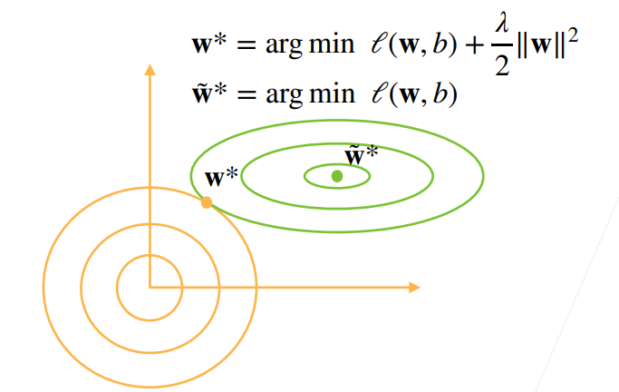
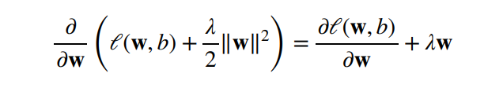
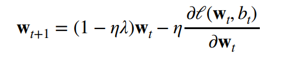
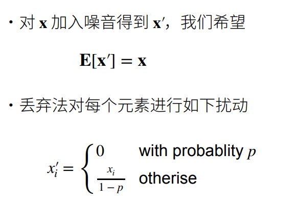
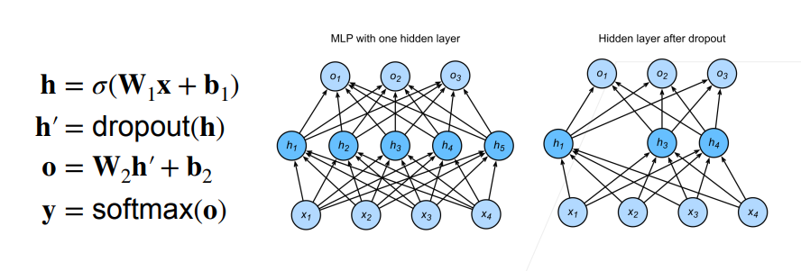

# 6 权重衰退

## 6.1 使用均方范数作为硬性限制

- 通过限制参数值的选择范围来控制模型容量

  $min \iota(w,b) subject to ||w||^2\leq\theta$

- 通常不限制偏移b （限制与否差不多）
- 小的$\theta$意味着更强的正则项

## 6.2 使用均方范数作为柔性限制

- 对于每个$\theta$，都可以找到$\lambda$使得之前的目标函数等价于下面

$$
min \iota(w,b)+\frac \lambda 2||w||^2
$$

- 可以通过拉格朗日子乘来证明
- 超参数$\lambda$控制了正则项的重要程度
- $\lambda = 0$ : 无作用
- $\lambda\to\infty,w^*\to0$

### 6.2.1 演示对最优解的影响

## 6.3 参数更新法则

- 计算梯度

  

- 时间t更新参数

- 通常$\eta\lambda\lt1$，在深度学习中通常叫做权重衰退

## 6.4 总结

- 权重衰退通过L2正则项使得模型参数不会过大，从而控制模型复杂度
- 正则项权重是控制模型复杂度的超参数

## 6.5 丢弃法

### 6.5.1 动机

- 一个好的 模型需要对输入数据的扰动鲁棒
- 使用有噪音的数据等价于Tikhonov正则
- 丢弃法：在层之间加入噪音

### 6.5.2 无偏差的加入噪音

### 6.5.3 使用丢弃法

通常将丢弃法作用在隐藏全连接层的输出上

### 6.5.4 推理中的丢弃法

- 正则项只在训练中使用：他们影响参数模型的更新
- 在推理过程中，丢弃法直接返回输入
- h=dropout(h)
- 这样也能保证确定性的输出

### 6.5.5 总结

- 丢弃法将一些输出项随机置0来控制模型复杂度
- 常作用在多层感知机的隐藏层输出上
- 丢弃概率是控制模型复杂度的超参数

