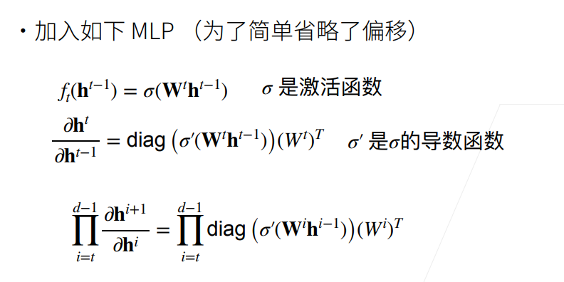
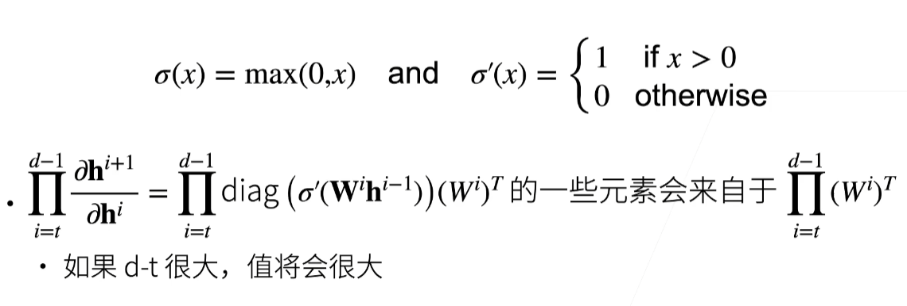
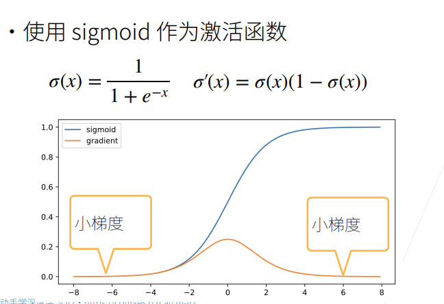
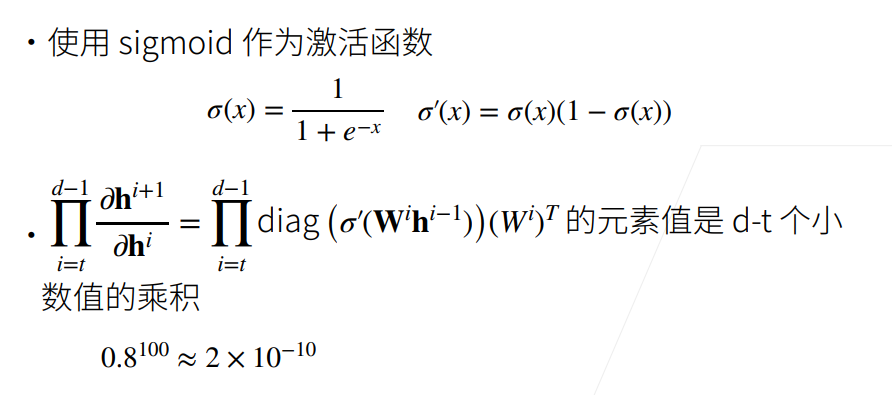
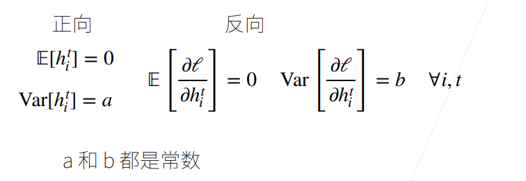
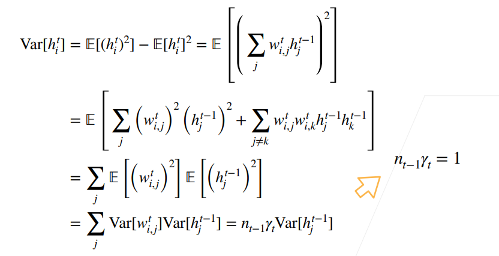
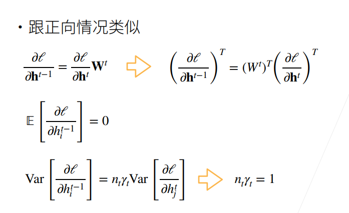
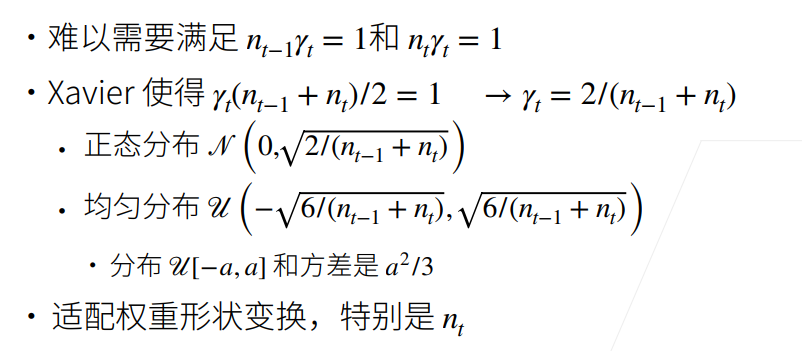

# 7 数值稳定性

## 7.1 数值稳定性的常见两个问题

### 7.1.1梯度爆炸

- MLP(多层感知机)

  

- 使用ReLU作为激活函数

  

- 梯度爆炸的问题

  - 值超出值域
  - 对于16位浮点数尤为严重（数值区间6e-5-6e4)

  - 对学习率敏感
  - 如果学习率太大->大参数值->更大的梯度
  - 如果学习率太小->训练无进展
  - 我们可能需要在训练过程不断调整学习率

### 7.1.2 梯度消失

### 7.1.3 梯度消失的问题

- 梯度值变成0（对16位浮点数尤为严重）
- 训练没有进展（不管如何选择学习率）
- 对于底部层尤为严重
  - 仅仅顶部层训练的较好
  - 无法让神经网络更深

### 7.1.4 总结

- 当数值过大或者过小时会导致数值问题
- 常发生在深度模型中，因为其会对n个数累乘

## 7.2 让训练更加稳定

- 目标：让梯度值在合理的范围内 例如[1e-6,1e3]
- 将乘法变加法：ResNet,LSTM
- 归一化：梯度归一化，梯度裁剪
- 合理的权重初始和激活函数

### 7.2.1 让每层的方差是一个常数

- 将每层的输出和梯度都看做随机变量
- 让它们的均值和方差都保持一致

### 7.2.2 权重初始化

- 在合理值区间里随机初始参数
- 训练开始的时候更容易有数值不稳定
- 远离最优解的地方损失函数表面可能很复杂
- 最优解附近表面会比较平
- 使用N（0，0.01）来初始可能对小网络没问题，但不能保证深度神经网络

### 7.2.3 正向方差

### 7.2.4 反向均值和方差

### 7.2.5 Xavier初始

### 7.2.6 检查常用激活函数

- 使用泰勒展开
- $sigmoid(x)=\frac 12+\frac x 4-\frac {x^3} {48}+O(x^5)$
- $tanh(x)=0+x-\frac {x^3} {3}+O(x^5)$
- $relu(x)=0+x$ for $x \ge 0$
- 调整sigmoid:$4 * sigmoid(x)-2$

### 7.2.7 总结

合理的权重初始值和激活函数的选取可以提升数值稳定性

