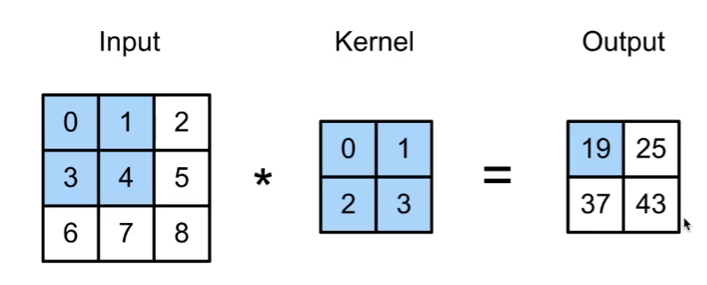
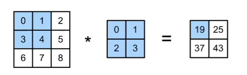
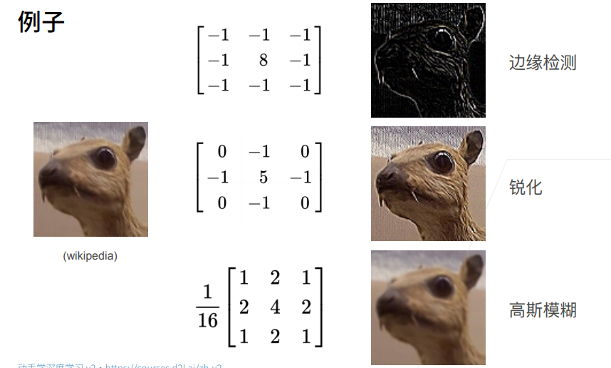

# 9 卷积

## 9.1 全连接层到卷积

- 两个原则
  - 平移不变性
  - 局部性

### 9.1.1 重新考察全连接层

- **将输入输出变形为矩阵（高度，宽度）**即从之前的一个一维向量还原成矩阵

- **将权重变形为4-D张量（h,w）到（$h^,$,$w^,$）**输入的高宽和输出的高宽 reshape一个4d的张量

     $h_i,_j$=$$\sum_{k,l}$$ $W_i,_j,_k,_lX_k,_l$ =$$\sum_{a,b}$$ $V_i,_j,_a,_bX_i+_a,_j+_b$      #k,l遍历两个维度求和

- V是W的重新索引 $V_i,_j,_a,_b$= $W_i,_j,_i+_a,_j+_b$

注意： $V_i,_j,_a,_b$是权重，识别图片的识别器

### 9.1.2 原则一：平移不变性

- X的平移导致 h 的平移  $h_i,_j$=$$\sum_{a,b}$$ $V_i,_j,_a,_bX_i+_a,_j+_b$       #若x发生变化，即i，j发生变化时，V也会变化

- v不应该依赖于（i，j)

- 解决方案：$V_i,_j,_a,_b$ =$V_a,_b$ 

  $h_i,_j$=$$\sum_{a,b}$$$V_a,_bX_i+_a , _j+_b$  不管i，j如何变化，V不再改变

这就是2维~~卷积~~（交叉相关）

理解：2维卷积就是全连接层或是一个矩阵乘法，但权重使得它的一些东西是重复的，不是每个元素都可以自由变换，把模型的取值范围做了限制，即降低了模型复杂度（不用存这么多元素了）。

### 9.1.3 原则二：局部性

$h_i,_j$=$$\sum_{a,b}$$$V_a,_bX_i+_a,_j+_b$   以i，j为中心，这里的a和b可以任意变换

- 当评估$h_i,_j$时，我们不应该用远离$X_i,_j$ 的参数
- 解决方案:当$|x|$，$|y|$>$\Delta$时，使得$V_a,_b$=0
- $h_i,_j$=$$\sum_{a=-\Delta}^\Delta$$$$\sum_{b=-\Delta}^\Delta $$ $V_a,_bX_i+_a,_j+_b$

#### 小结：

对全连接层使用**平移不变性**和**局部性**得到卷积层

## 9.2 图像卷积

### 9.2.1 二维交叉相关

0x0+1x1+3x2+4x3=19 ***对应位置分别相乘再相加***

1x0+2x1+4×2+5×3=25

3×0+4x1+6x2+7×3=37

4×0+5x1+7x2+8×3=43

### 9.2.1 二维卷积层

- 输入**X**：$n_h*n_w$

- 核**W**=$k_h*k_w$

- 偏差b$\epsilon$ R

- 输出**Y**：（$n_h-k_h$+1）*（$n_w-k_w$+1）

     			Y = X ★ W + b      #★定义二维交叉相关

- **W**和b是可学习的参数

### 9.2.2 交叉相关 VS 卷积

- 二维交叉相关

     $y_i,_j$​= $$\sum_{a=1}^h $$​ $$\sum_{b=1}^w $$$W_a,_bX_{i+a,j+b}$​

- 二维卷积

  		   $y_i,_j$​​​​=$$\sum_{a=1}^h $$​​​​ $$\sum_{b=1}^w $$​$W_{-a},_{-b}x_{i+a,j+b}$​​​​ 

  注意：卷积在索引w的时候，反过来了，由于对称性，在实际使用中没有区别

### 9.2.3 一维和三维交叉相关 

- 一维（文本，语言，时序序列）

  			  $y$​=$\sum_{a=1}^h $​ $W_aX_{i+a}$​

- 三维（视频，医学图像，气象地图）

  $y_i,_j,_k$​=$\sum_{a=1}^h $$\sum_{b=1}^w $$\sum_{c=1}^d $$W_a,_b,_cX_{i+a},_{j+b},_{k+c}$​

总结：

- 卷积层将输入和核矩阵进行交叉相关，加上偏移后得到输出
- 核矩阵和偏移是可学习的参数
- 核矩阵的大小是超参数
