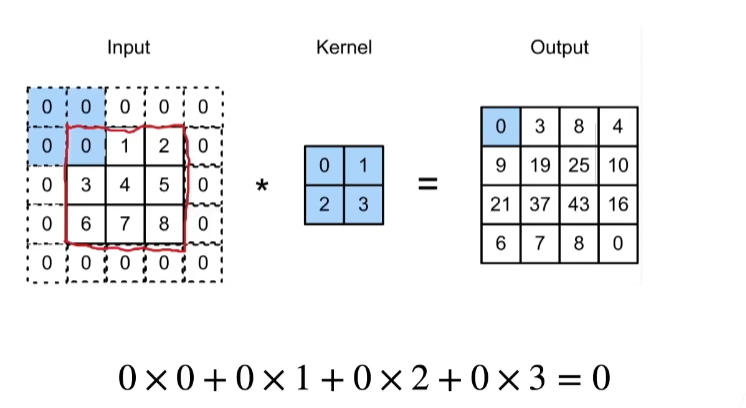

# 10 填充和步幅

@author：童欣

@date：2021.07.15

卷积层控制输出大小的两个超参数

## 10.1 填充

### 10.1.1 例子

- 给定（32x32) 输入图像
- 应用5x5大小的卷积核
  - 第一层得到输出大小28x28
  - 第七层得到输出大小4x4
- 更大的卷积核可以更快地减小输出大小
- 形状从$n_h$X$n_w$减少到$(n_h-k_n+1) \times (n_w-k_w+1)$

### 10.1.2 填充的目的

- 填充的目的是做更深的深度模型
- 在输入的四周加入一些额外的行和列，达到输出比以前更大

### 10.1.3 填充相关

- 填充$p_h$行和$p_w$列，输出形状为

  $(n_h-k_h+p_h+1)\times(n_w-k_w+p_w+1)$

- 通常取$p_h=k_h-1$,$p_w=k_w-1$（好处是$-k_h+p_h+1=0$，$-k_w+p_w+1=0$ 输入和输出的形状不会发生变化）
  - 当$k_h$为奇数：在上下两侧填充$p_h/2$
  - 当$k_h$为偶数：在上侧填充$\lceil p_h/2 \rceil$，在下侧填充$\lfloor p_h/2 \rfloor$

### 10.1.4 结论

- 填充减小的输出大小与层数线性相关
- 给定输入大小224x224，在使用5x5卷积核的情况下，需要44层将输出降低到4x4
- 需要大量计算才能得到较小输出

## 10.2 步幅

- 步幅减小的输出大小与层数指数相关

- 步幅是指行/列的滑动步长
- 例：高度3 宽度2 的步幅

- 给定高度$s_h$和宽度$s_w$的步幅，输出形状是

  $\lfloor(n_k-k_h+p_h+s_h)/s_h\rfloor \times \lfloor(n_w-k_w+p_w+s_w)/s_w$

- 如果$p_h=k_h-1$,$p_w=k_w-1$

  $\lfloor(n_k+s_h-1)/s_h\rfloor \times \lfloor(n_w+s_w-1)/s_w$

- 如果输入高度和宽度都可以被步幅整除

  $(n_h/s_h)\times(n_w/s_w)$

  (步幅取2，宽度和高度都是偶数时)

## 10.3 总结

- 填充和步幅都是卷积层的超参数
- 填充在输入周围添加额外的行/列，来控制输出形状的减少量
- 步幅是每次滑动卷积核窗口时的行/列的步长，可以成倍的减少输出形状

## 10.4 多输入多输出通道

### 10.4.1 多个输入通道

每个通道都有一个卷积核，结果是所有通道卷积结果的和

- 输入X：$c_i\times n_h\times n_w$（$c_i$是偏移量）
- 核W：$c_i \times k_h \times k_w$
- 输出Y：$m_h \times m_w$（输出是单通道）

$Y=\sum_{i=0}^{c_i}X_{I,:,:}*W_{i,:,:}$

### 10.4.2 多个输出通道

- 无论有多少输入通道，到目前为止我们只用到单输出通道
- 我们可以有多个三维卷积核，每个核生成一个输出通道
- 输入X：$c_i\times n_h\times n_w$（$c_i$是偏移量）
- 核W：$c_o \times c_i \times k_h \times k_w$
- 输出Y：$c_o \times m_h \times m_w$

$Y_{i,:,:}=X*W_{i,:,:}$  for i=1,...,$c_o$

### 10.4.3 作用

- 每个输出通道可以识别特定模式
- 输入通道核识别并组合输入中的模式

### 10.4.4 1 x 1卷积层

$k_h=k_w=1$是一个受欢迎的选择。它不识别空间模式，只是融合通道。

相当于输入形状为$n_hn_w \times c_i$，权重为$c_o \times c_i$ 的全连接层

### 10.4.5 二维卷积层

通用情况

- 输入X：$c_i\times n_h\times n_w$ (输入维度 高 宽)
- 核W：$c_o \times c_i \times k_h \times k_w$ （输出的通道数 输入通道数 高 宽）
- 偏差B：$c_o \times c_i$
- 输出Y：$c_o \times m_h \times m_w$
- $Y = X*W+B$

- 计算复杂度 (浮点计算数) $O(c_ic_ok_hk_wm_hm_w)$

## 10.5 总结

- 输出通道数是卷积层的超参数
- 每个输入通道有独立的二位卷积核，所有通道结果相加得到一个输出通道结果
- 每个输出通道有独立的三维卷积核
