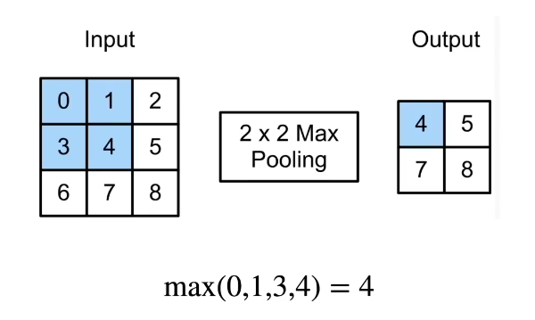
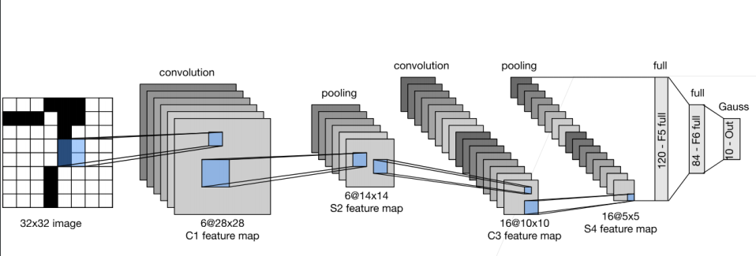

# 11 池化层

@author：童欣

@date：2021.07.16

- 卷积层对位置敏感
- 需要一定程度的平移不变性

## 11.1 二维最大池化

- 返回滑动窗口中的最大值

  

## 11.2 池化层的特点

- 池化层与卷积层类似，都具有填充和步幅
- 没有可学习的参数
- 在每个输入通道应用池化层以获得相应的输出通道
- 输出通道数=输入通道数

## 11.3 平均池化层

- 最大池化层：每个窗口中最强的模式信号
- 平均池化层：将最大池化层中的“最大”操作替换为“平均”

## 11.4 总结

- 池化层返回窗口中最大或平均值
- 缓解卷积层位置的敏感性
- 同样有窗口大小、填充和步幅作为超参数

## 11.5 LeNet 经典卷积神经网络

- MNIST 数据集
- 50000个训练数据
- 10000个测试数据
- 图像大小28x28
- 10类

- 输入 32x32的图片
- 放到5x5的卷积层里 输出6通道 28x28
- 放到2x2池化层 6通道 14x14 
- 放到5x5卷积层 16通道 10x10
- 放到2x2池化层 16通道 5x5
- 全连接层 输出120 64 10

## 11.6 总结

- LeNet是早期成功的神经网络
- 先使用卷积层来学习图片空间信息
- 然后使用全连接层来转换到类别空间