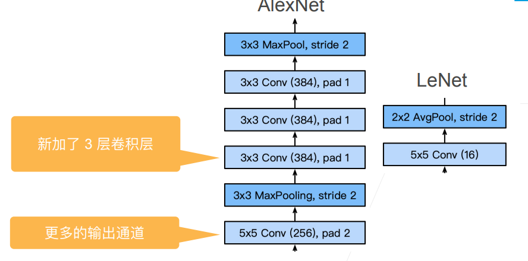

# 12 AlexNet

- 更深更大的LeNet
- 主要改进：
  - 丢弃法
  - ReLu
  - MaxPooling
- 计算机视觉方法论的改变

## 12.1 AlexNet 架构

## 12.2 更多细节

- 激活函数从sigmoid变到了ReLu（减缓梯度消失）
- 隐藏全连接层后加入了丢弃层
- 数据增强

## 12.3 复杂度

## 12.4 总结

- AlexNet是更大更深的LeNet，10x参数个数，260x计算复杂度
- 新引入了丢弃法，ReLU，最大池化层和数据增强

## 12.5 使用块的网络VGG

- 更深更大数据更多的发展方向
- VGG块
  - 3x3卷积（填充1）（n层，m通道）（比起5x5卷积深但窄效果更好）
  - 2x2最大池化层（步幅2）

## 12.6 VGG架构

- 多个VGG块后接全连接层
- 不同次数的重复块得到不同的架构VGG-16,VGG-19等

## 12.7 进度

- LeNet(1995)
  - 2卷积+池化层
  - 2全连接层
- AlexNet
  - 更大更深
  - ReLu,Dropout,数据增强
- VGG
  - 更大更深的AlexNet(重复的VGG块)

## 12.8 总结

- VGG使用可重复使用的卷积块来构建深度卷积神经网络
- 不同的卷积块个数和超参数可以得到不同复杂度的变种

