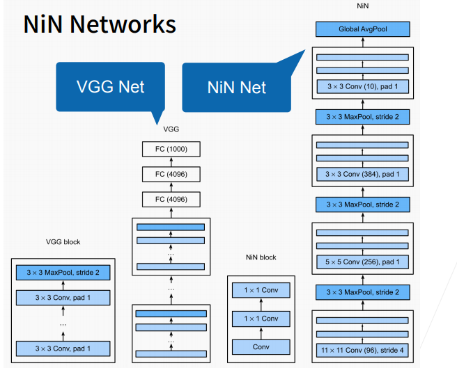

# 13 网络中的网络（NiN）

- 全连接层的问题
- 卷积层需要较少的参数 $c_i\times c_o \times k^2$
- 但卷积层后的第一个全连接层的参数上来看 VGG占用的内存大

## 13.1 NiN块

- 一个卷积层后跟两个全连接层
  - 步幅1，无填充，输出形状跟卷积层输出一样
  - 起到全连接层的作用

## 13.2 NiN架构

- 无全连接层
- 交替使用NiN块和步幅为2的最大池化层
  - 逐步减小高宽和增大通道数
- 最后使用全局平均池化层得到输出
  - 其输入通道数是类别数

## 13.3 总结

- NiN块使用卷积层加两个1x1卷积层
  - 后者对每个像素增加了非线性性
- NiN使用了全局平均池化层来替代VGG和AlexNet中的全连接层
  - 不容易过拟合，更少的参数个数

## 13.4 含并行连结的网络（GoogLeNet)

