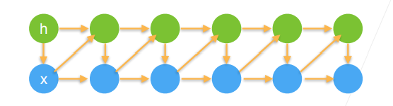

# 24 序列模型

- 序列数据
- 实际中很多数据是有时序结构的（音乐、语言、文本、视频、地震、人的互动、股价）

## 24.1 统计工具

- 在时间t观察到$x_t$，那么得到T个不独立的随机变量

  $(x_1,..,x_T) \sim p(x)$​

- 使用条件概率展开

  $p(a,b)=p(a)p(b|a)=p(b)p(a|b)$

- $p(x)=p(x_1) \cdot p(x_2|x_1) \cdot p(x_3|x_1,x_2) \cdot \ldots p(x_T|x_1, \ldots x_{T-1})$

- $p(x)=p(x_T) \cdot p(x_{T-1}|x_T) \cdot p(x_{T-2}|x_{T-1},x_T) \cdot \ldots p(x_1|x_2, \ldots x_T)$​

  物理上不一定可行

## 24.2 序列模型

- $p(x)=p(x_1) \cdot p(x_2|x_1) \cdot p(x_3|x_1,x_2) \cdot \ldots p(x_T|x_1, \ldots x_{T-1})$

- 对条件概率建模 $p(x_t|x_1,\ldots x_{t-1})=p(x_t|f(x_1,\ldots x_{t-1}))$

对见过的数据建模，也称自回归模型

### 24.2.1 方案A-马尔科夫假设

- 假设当前数据只跟$\tau$个过去数据点相关
- $p(x_t|x_1,\ldots x_{t-1})=p(x_t|x_{t-\tau},\ldots x_{t-1})=p(x_t|f(x_{t-\tau},\ldots x_{t-1}))$​​

（假如在过去数据上训练一个MLP模型）

给定一个变量，使得不用处理变长的数据，处理定长的数据之前所有的技术都可以用

### 24.2.2 方案B-潜变量模型

- 引入潜变量$h_t$来表示过去信息$h_t =f(x_1,\ldots x_{t-1})$

- $x_t=p(x_t|h_t)$

## 24.3 总结

- 时序模型中，当前数据跟之前观察到的数据相关
- 自回归模型使用自身过去数据来预测未来
- 马尔科夫模型假设当前只跟最近少数数据相关，从而简化模型
- 潜变量模型使用潜变量来概括历史信息
