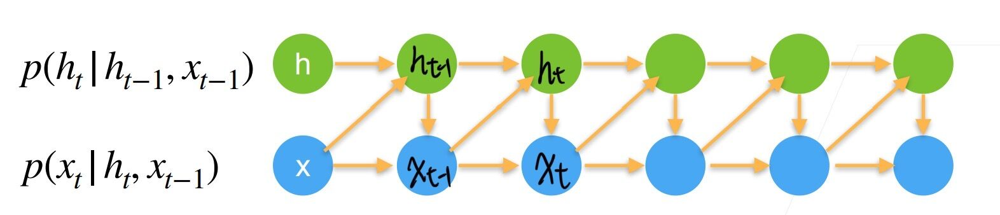
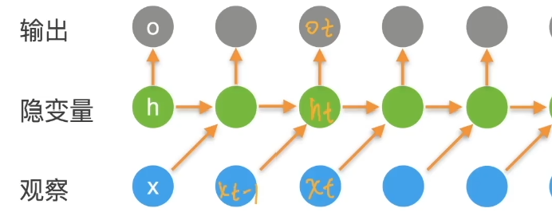
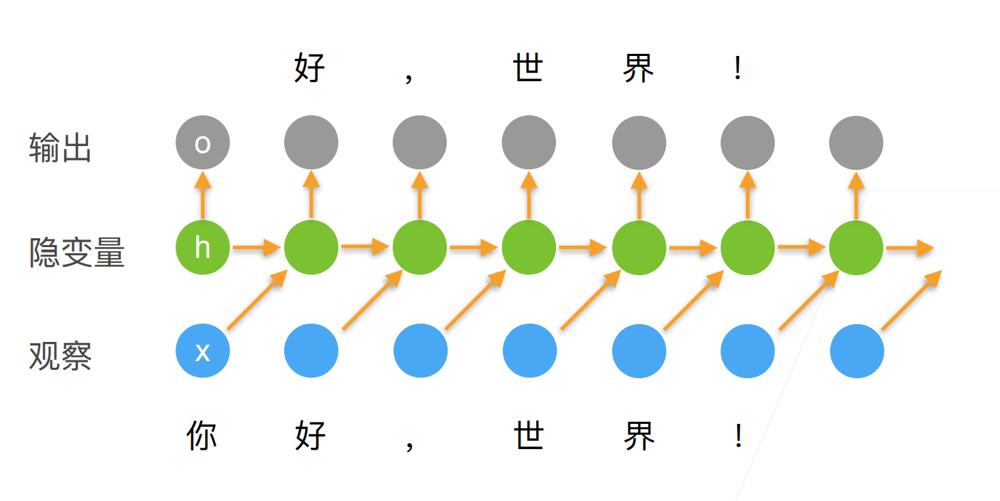
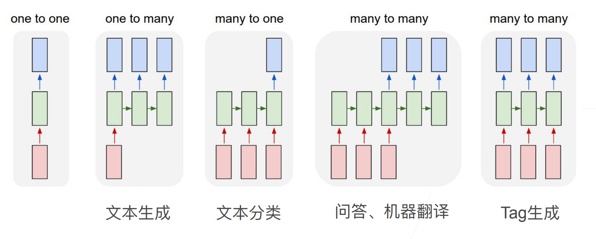

# 25 语言模型

- 给定文本序列$x_1,\ldots,x_T$，语言模型的目标是估计联合概率$p(x_1,\ldots,x_T)$
- 它的应用包括
  - 做预训练模型（例如BERT,GPT-3）
  - 生成文本，给定前面几个词，不断地使用$x_t \sim p(x_t|x_1,\ldots,x_{t-1})$来生成后续文本
  - 判断多个序列中哪个更常见，例如"to recognize speech"和“to wreck a nice beach”

## 25.1 使用计数来建模

- 假设序列长度为2，我们预测$p(x,x')=p(x)p(x'|x)=\frac {n(x)} n \frac {n(x,x')} {n(x)}$
- 这里n是总词数，$n(x),n(x,x')$是单个单词和连续单词对的出现次数
- 很容易拓展到长为3的情况
- $p(x,x',x'')=p(x)p(x'|x)p(x''|x,x')=\frac {n(x)} n \frac {n(x,x')} {n(x)} \frac {n(x,x',x'')} {n(x,x')}$​​

## 25.2 N元语法

- 当序列很长时，因为文本量不够大，很可能$n(x_1,\dots,x_T)\le1$
- 使用马尔科夫假设可以缓解这个问题
- 一元语法：$p(x_1,x_2,x_3,x_4)=p(x_1)p(x_2)p(x_3)p(x_4)=\frac {n(x_1)} n \frac {n(x_2)} n \frac {n(x_3)} n \frac {n(x_4)} n$​
- 二元语法：$p(x_1,x_2,x_3,x_4)=p(x_1)p(x_2|x_1)p(x_3|x_2)p(x_4|x_3)=\frac {n(x_1)} n \frac {n(x_1,x_2)} n \frac {n(x_2,x_3)} n \frac {n(x_3,x_4)} n$​​
- 三元语法：$p(x_1,x_2,x_3,x_4)=p(x_1)p(x_2|x_1)p(x_3|x_1,x_2)p(x_4|x_2,x_3)$​

## 25.3 总结

- 语言模型估计文本序列的联合概率
- 使用统计方法时常采用n元语法

## 25.4 循环神经网络（RNN）

- 第一个对序列模型的神经网络

### 25.4.1 潜变量自回归模型

- 使用潜变量$h_t$总结过去信息

### 25.4.2 循环神经网络

- 更新隐藏状态：$h_t=\Phi(W_{hh}h_{t-1}+W_{hx}x_{t-1}+b_h)$  用$W_{hh}$存时序信息

- 输出：$O_t=\Phi(W_{ho}h_t+b_o)$​
- 计算损失用的是$o_t$和$x_t$的差
- 去掉$W_{hh}h_{t-1}$​就退化成MLP $h_t=\Phi(W_{hx}x_{t-1}+b_h)$​ 

### 25.4.3 使用循环神经网络的语言模型

## 25.5 困惑度（perplexity）

- 衡量一个语言模型的好坏可以用平均交叉熵
- $\pi = \frac 1 n \sum^n_{i=1} - log p(x_t|x_{t-1},\dots) $
- p是语言模型的预测概率，$x_t$是真实词
- 历史原因NLP使用困惑度$exp(\pi)$​来衡量，是平均每次可能选项（1表示完美，无穷大是最差情况）

## 25.6 梯度裁剪

- 迭代中计算这T个时间步上的梯度，在反向传播过程中产生长度为O(T)的矩阵乘法链，导致数值不稳定
- 梯度裁剪能有效预防梯度爆炸
- 如果梯度长度超过$\theta$，那么投影回长度$\theta$​
- $g \leftarrow min(1,\frac \theta {||g||})g$

## 25.7 更多的应用RNNs

## 25.8 总结

- 循环神经网络的输出取决于当下输入和前一个时间的隐变量
- 应用到语言模型中时，循环神经网络根据当前词预测下一次时刻词
- 通常使用困惑度来衡量语言模型的好坏